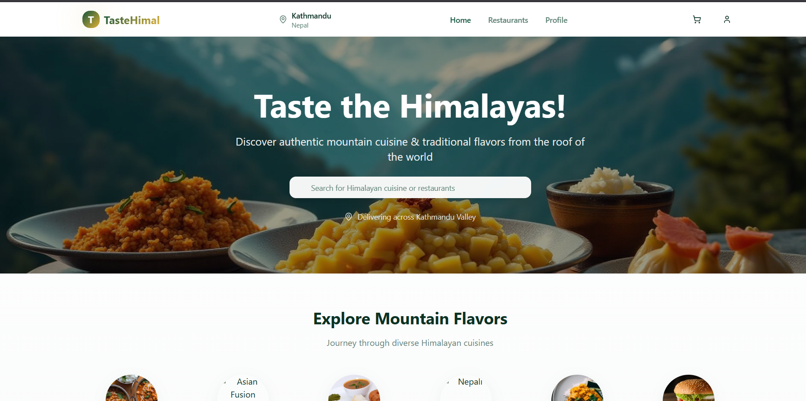

# 🍲TasteHimal-Foodtech-Application
TasteHimal  a FoodTech web application using AWS, Jenkins, Terraform, SonarQube, Trivy, and Docker. Focused on infrastructure automation, continuous integration, security scanning, and seamless deployment.
> 🚀 **Live Demo**: [https://meek-croquembouche-441e8b.netlify.app](https://meek-croquembouche-441e8b.netlify.app)

---
## 📸 Project Preview

 <!-- Optional if you want to upload screenshot -->

---

## 📁 Folder Structure
```plaintext
├── dist/                   # Production build output
├── public/                 # Static assets like images, favicon
├── src/                    # All React components and frontend logic
├── .gitignore              # Git ignored files
├── Dockerfile              # Docker configuration to containerize the app
├── README.md               # Project documentation
├── bun.lockb               # Lock file for Bun package manager
├── components.json         # Optional component metadata
├── index.html              # Root HTML file
├── install.sh              # Setup shell script
├── jenkinsfile             # Jenkins pipeline definition
├── package.json            # Project dependencies and scripts
├── package-lock.json       # Dependency lock file
├── postcss.config.js       # PostCSS configuration
├── tailwind.config.ts      # Tailwind CSS configuration
├── tsconfig.app.json       # TypeScript config for app compilation
└── tsconfig.json           # Base TypeScript configuration
```
---

## 💻 Tech Stack

- **Frontend Framework**: React.js + Vite
- **Language**: TypeScript
- **Styling**: Tailwind CSS
- **Bundler**: Vite
- **Package Manager**: bun
- **Hosting**: Netlify (Primary)

---

## 🛠️ Features

- 🔍 Search restaurants and dishes
- 🛒 Add to cart functionality (UI level)
- 📱 Fully responsive layout
- ✨ Beautiful animations and clean UI
- 🧩 Componentized structure for scalability

---

## 🧪 Local Development

### Prerequisites

- Node.js or Bun
- Git

### Steps

```bash
# Clone the repo
git clone  https://github.com/Ssumit09/TasteHimal-Foodtech-Application.git
cd your-repo

# Install dependencies
npm install

# Run the dev server
npm run dev
```
## 🐳 Docker Support
Build and run the project using Docker:

# Build the image
docker build -t TasteHimal .
# Run the container
docker run -p 3000:3000 TasteHimal

## ⚙️ Jenkins CI/CD (Previously Deployed on AWS)
This project was also deployed on AWS EC2 using a complete CI/CD pipeline setup with:

Terraform: Infrastructure as Code for provisioning EC2, security groups, etc.
Jenkins: Automated build and deployment pipeline
Docker: Containerized the app for consistent deployment

Due to AWS billing concerns, this pipeline is currently inactive, and deployment is now served through Netlify.

## 🧾 License
This project is licensed under the MIT License.

## 🙋‍♂️ Author
Sumit Kumar Jha
🌐 GitHub


Let me know if you'd like the preview image markdown section to display a screenshot. I can guide you on how to add it too.


